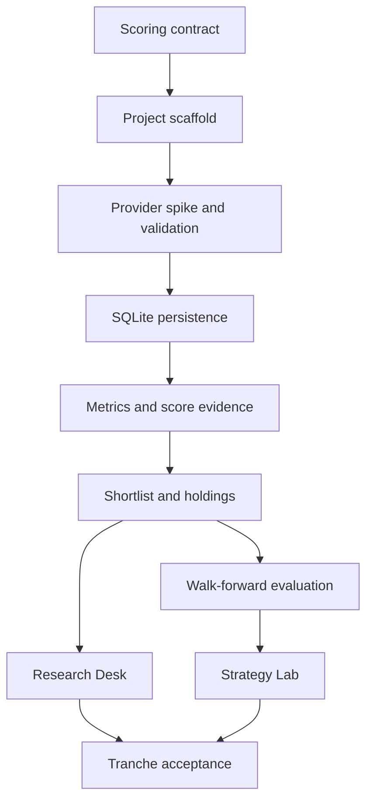

# Implementation Plan: Tranche One Research Foundation

## Overview

Deliver a local, explainable NIFTY 50 research workflow in small vertical slices. The first release validates the risky external-data boundary early, stores validated prices locally, produces a deterministic stock shortlist and holding review, then adds historic cohort evaluation and the Streamlit Research Desk and Strategy Lab. Mutual funds remain behind an explicit provider contract with fixtures only.

## Dependency Graph

## Architecture Decisions

- Keep provider I/O, SQLite persistence, financial calculations, and Streamlit rendering in separate modules so deterministic logic is independently testable.
- Validate the `yfinance` NSE path in a small integration spike before making UI or scoring work depend on it.
- Persist source metadata and validation results with prices; the application must be able to explain when data is stale or inadequate.
- Freeze a simple price-only score before walk-forward evaluation. Evaluation observes the score; it does not adjust weights.
- Treat mutual-fund records as fixtures until an approved source meets coverage, provenance, licensing, and adjusted-NAV requirements.

## Implementation Sequence

### Phase 1: Contracts And Data Foundation

- [ ] Task 1: Define the fixed price-based scoring contract.
- [ ] Task 2: Scaffold the Python package, local tooling, and ignored data boundary.
- [ ] Task 3: Prove and validate the NIFTY 50 price-provider path.
- [ ] Checkpoint: score contract reviewed; fixture-based provider tests and local quality checks pass.

### Phase 2: Research Pipeline

- [ ] Task 4: Persist validated stock prices and refresh metadata in SQLite.
- [ ] Task 5: Calculate score evidence and build the valid-stock shortlist.
- [ ] Task 6: Add manual holding review using the shared score pipeline.
- [ ] Checkpoint: a fixture-backed refresh produces an inspectable top-five shortlist and holding result.

### Phase 3: Evaluation And Interface

- [ ] Task 7: Build six-month walk-forward cohort evaluation.
- [ ] Task 8: Build the Streamlit Research Desk.
- [ ] Task 9: Build the Streamlit Strategy Lab and fixture-status presentation.
- [ ] Checkpoint: end-to-end local workflow, test suite, lint, and manual UI review pass.

### Phase 4: Tranche Acceptance

- [ ] Task 10: Document limitations, run final quality checks, and assess success criteria.
- [ ] Checkpoint: project-owner review before merging the feature branch to `main`.

## Risks And Mitigations

| Risk | Impact | Mitigation |
| --- | --- | --- |
| NSE symbols or adjusted-price behavior are unreliable through `yfinance` | High | Run Task 3 early with a small representative symbol set; retain the provider interface so a replacement is localized. |
| Price history is incomplete, stale, or too short | High | Block ranking for invalid data and expose a validation warning with source and as-of metadata. |
| Scoring weights overfit historic periods | High | Freeze and document the scoring contract before Task 7; never tune against the evaluated periods. |
| Fund fixtures are mistaken for live research | High | Carry `is_fixture`, source type, and as-of metadata through every domain and UI representation. |
| UI obscures uncertainty | Medium | Make status, completeness, freshness, and limitations first-class fields in the Research Desk and Strategy Lab. |

## Parallelization

Tasks 1 through 4 are sequential because their contracts feed every downstream slice. Once Task 5 is stable, the Research Desk (Task 8) and evaluation implementation (Task 7) can proceed independently against shared deterministic fixtures. Task 9 joins those completed outputs.

## Definition Of Done

- The approved specification's success criteria are demonstrably satisfied.
- `pytest -q` and `ruff check .` pass without network access for automated tests.
- The local Streamlit app is manually verified with fixture data and a successful live-provider refresh when network access is available.
- Documentation reflects the actual data source, metrics, known limitations, and validation behavior.
- Each completed task is committed atomically on a short-lived `feature/tranche-one-foundation` branch.